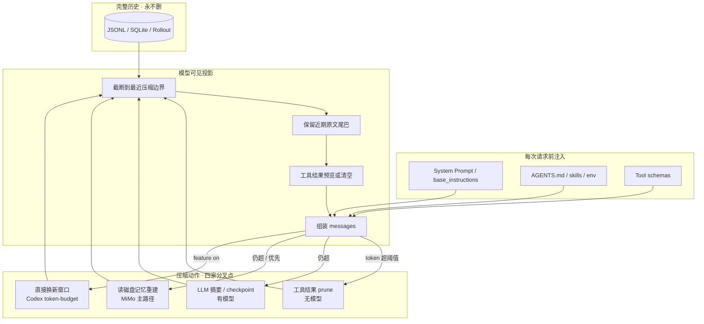
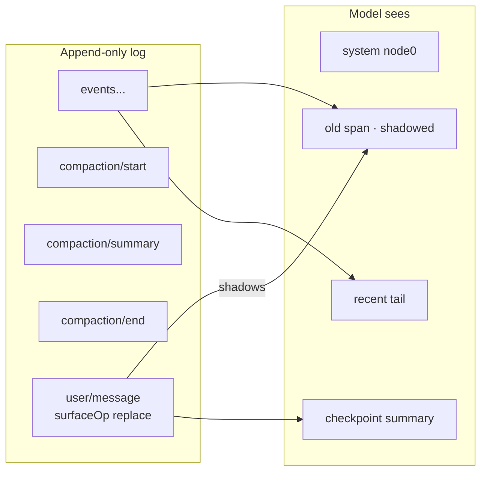
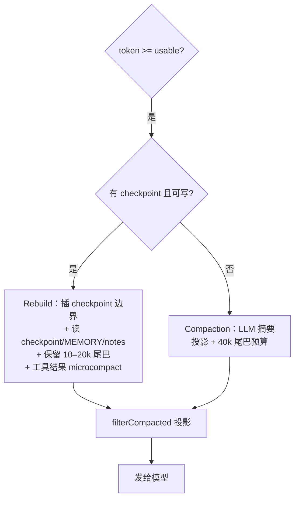
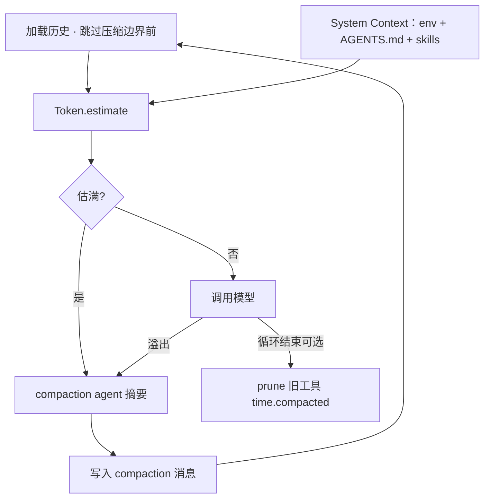
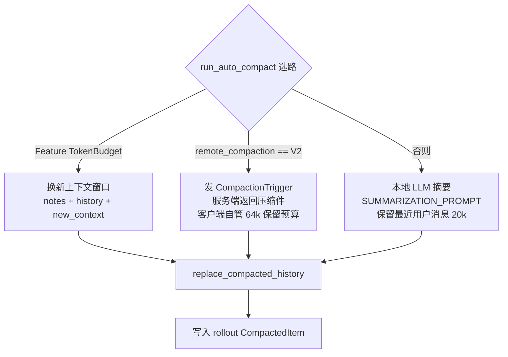

# 上下文管理与压缩：四套 Coding Agent 对比调研

> **一句话结论**  
> 四家都采用同一套底层思路：**完整历史永不删，只改模型「看得见」的投影**。  
> 区别在于：用不用 LLM 做摘要、阈值定多少、工具输出怎么截、有没有「写到磁盘再读回来」的记忆层。

| 项目 | 本地路径 | 上游仓库 |
|---|---|---|
| dsh (DeepSeek Harness) | `H:\deepseek-harness` | deepseek-ai/deepseek-harness |
| MiMo-Code | `H:\MiMo-Code` | XiaomiMiMo/MiMo-Code |
| OpenCode | `H:\opencode` | anomalyco/opencode |
| Codex CLI | `H:\codex` | openai/codex |

调研日期：**2026-09-17**  
证据来源：本地源码（优先）+ 子任务结构化摘录  
深度：standard（4 个并行代码考古任务）

---

## 0. 方法与诚实边界（先读）

**没有逐行读完四个仓库的全部代码。** 那不现实（仅 dsh 就有约 4900 个 TS 文件）。

实际做法：

1. 按关键词搜（compact / compress / token / prune / truncate / session…）
2. 定位**主实现文件**后精读
3. 交叉看测试文件确认默认值
4. 主报告写完后，对关键常量再抽查一遍

| 仓库 | 精读范围（相对） | 未覆盖 |
|---|---|---|
| dsh | `packages/compaction/*`（约 45 个 TS）+ token-meter + session surface + session-clear | UI、无关插件、大部分 adapter |
| MiMo-Code | `src/session/*` 压缩相关（约 51 个）+ memory + prune/checkpoint | TUI、大部分 tool 实现细节 |
| OpenCode | `packages/opencode/src/session/*` + `packages/core/src/session/*` | web/console、provider 细节 |
| Codex | `core/src/compact*.rs`（约 15 万字符）+ context_manager + models.json | TUI、大部分 tool、otel |

**抽查已核对（2026-09-17）：**

| 声称 | 代码位置 | 结果 |
|---|---|---|
| dsh 0.8 / 0.16 | `compaction-basic/src/config.ts` L20–23 | ✅ |
| dsh chars/4 | `token-meter/src/estimate.ts` L13 | ✅ |
| MiMo 0.9 / 33k / 40k tail | `overflow.ts` `flag.ts` `compaction.ts` | ✅ |
| MiMo soft-trim 4096 | `prune.ts` L21 | ✅ |
| OpenCode 20k buffer / 15k max tail | `overflow.ts` `compaction.ts` | ✅ |
| Codex 20k / 64k / bytes/4 | `compact.rs` `compact_remote_v2.rs` `truncate.rs` | ✅ |

**置信度**

- 高：阈值公式、主压缩路径、存储格式、工具截断上限
- 中：多策略并发时的边界条件、feature-gated 分支全貌
- 低/未声称：真实中文 token 误差、压缩后任务成功率、线上默认配置占比

---

## 0b. 怎么读这份报告

你只需要先看懂 **第 1 节对比表** 和 **第 2 节总图**。  
后面每个系统一节。每节开头都有一句「人话结论」。

如果只想知道「谁最狠 / 谁最保守」，直接跳到 **第 8 节选型建议**。

---

## 1. 四家对比总表（先看这张）

| 维度 | **dsh** | **MiMo-Code** | **OpenCode** | **Codex** |
|---|---|---|---|---|
| 语言 / 主实现 | TypeScript | TypeScript | TypeScript（V1+V2） | **Rust** |
| 历史存储 | 追加写 JSONL（zstd） | SQLite `session/message/part` | SQLite（V1/V2） | JSONL rollout |
| 是否删除历史 | **否**（surface 遮罩） | **否**（投影） | **否**（投影） | **否**（替换窗口，rollout 仍在） |
| Token 估算 | chars/4 | chars/4 | chars/4 | bytes/4；**主账用服务端 usage** |
| 自动压缩触发 | 窗口 × **0.8** | 可用上下文 × **0.9** | 估满 + **20k** 缓冲 | 窗口 **90%**（硬顶 95%） |
| 保留近期原文 | 窗口 × **16%** | 尾巴 **10–40k** | 尾巴 **2k–15k**（V1）/ **8k**（V2） | 本地 **20k** 用户消息；远程 V2 **64k** |
| 主压缩方式 | LLM 结构化 checkpoint | **优先 checkpoint 重建**，否则 LLM 摘要 | LLM 摘要（固定模板） | 三选一：本地摘要 / 远程 V2 / **换新窗口** |
| 无模型折叠 | `/clear` 确定性折叠 | prune / hard-clear | prune（可选） | 无（换窗口时靠 notes） |
| 工具输出截断 | 8192 码点 → 头4k+尾1k；bash 64KB spill | 2000行/50KB + spill；软裁 4k→1.5k×2 | 2000行/50KB + spill | **默认 10k tokens 中截**（写入时就截） |
| 记忆 / AGENTS.md | AGENTS.md 作预算化 user 消息 | **MEMORY.md + checkpoint.md + notes.md** + FTS | AGENTS/CLAUDE/CONTEXT 注入 system | AGENTS.md **32KB** 拼接，user 角色注入 |
| 压缩后能否回放原文 | 能（log 完整） | 能（SQLite 完整 + history 工具） | 能 | 能（rollout 完整） |
| 最有特色的一点 | surface `replace` + 事务锁 | **后台写 checkpoint → 重启上下文** | V2 **Context Epoch** 基线 | **服务端 Compaction V2** + token-budget 换窗 |

---

## 2. 共同骨架（总图）

四家都能画成同一张流水线。真正分叉只在「压缩动作」那一层。



**记忆口诀**

1. 存：全量落盘  
2. 算：chars/4 或服务端 usage  
3. 截：先砍工具输出（便宜、无模型）  
4. 折：再 LLM 摘要或读记忆重建（贵、有损）  
5. 保：永远留下一小段最近原文

---

## 3. dsh（DeepSeek Harness）

### 人话结论

dsh 把对话当成 **只追加的事件日志**。  
压缩**不删日志**，只在「表面视图」上盖一层替换标记。  
阈值偏保守（80% 窗口就动手）。有无模型的两种折叠。

### 3.1 架构

| 层 | 是什么 | 代码位置 |
|---|---|---|
| Session log | 追加写事件流 | `packages/core/session` |
| Surface | 消息类事件的有序视图 | `packages/core/session/src/surface.ts` |
| TokenMeter | 估价器 + 压力 | `packages/llm/token-meter` |
| Compaction | 摘要 + 替换 | `packages/compaction/compaction-basic` |
| Tool pruner | 无模型截断 | `packages/compaction/compaction-tool-result-pruner` |
| session-clear | 手动 `/clear` 折叠 | `packages/host/session-clear` |



### 3.2 阈值（记这些就够）

| 参数 | 默认 | 含义 |
|---|---|---|
| `thresholdRatio` | **0.8** | `floor(窗口 × 0.8)` 就触发 |
| `retainRatio` | **0.16** | 保留 `floor(窗口 × 0.16)` 原文尾巴 |
| 估算 | **4 字符 = 1 token** | 中文/JSON Schema 会低估 |
| 工具 prune | 超 **8192** 码点 | 留头 4096 + 尾 1024，中间打标记 |
| AGENTS.md | 基线 **64KB** | 以 user 消息注入 |

### 3.3 压缩流程

1. **压力触发**（每步 agent 前）或 **溢出触发**（`CONTEXT_WINDOW_EXCEEDED`）  
2. 先做无模型 **tool-result prune**（头/标记/尾）  
3. 再测压力；若仍高 → 选最老的一段「配对平衡」区域  
4. 用 LLM 产出固定结构 checkpoint（Primary Request / Files / Errors / Next…）  
5. 写入 `user/message` + `surfaceOp: replace`，盖住旧区段  
6. 日志里的 `compaction/*` 事件全部保留

手动：
- `/compact` → 走 LLM 摘要  
- `/clear`（session-clear）→ **无 LLM**，把更早的轮次折叠成一个标记，默认保留最近 10 轮

### 3.4 持久化

```
<root>/<cwd>/<session-id>/
  session.v3.jsonl.zstd   # 默认 zstd 帧
  session.v2.jsonl.zstd   # 旧代保留
```

崩溃可恢复撕裂尾部；已提交事件不改写。

---

## 4. MiMo-Code

### 人话结论

MiMo 把「数据库里的完整对话」和「发给模型的那一段」**彻底分开**。  
最特别的是：**后台子代理把重要状态写成文件**（checkpoint / MEMORY / notes），  
下次上下文爆了就 **读这些文件重建**，而不是硬做一次性摘要。

引擎目录：`packages/opencode/src/`（OpenCode 血统 + MiMo 扩展）

### 4.1 双路径压缩



| 路径 | 触发 | 产出 |
|---|---|---|
| **Checkpoint rebuild（优先）** | 可用上下文 ≥ 阈值；已有 `checkpoint.md` | 合成 checkpoint 边界 + 文件 dump + 保留尾巴 |
| **LLM compaction（回退）** | 无 checkpoint / 关闭 / 写失败 | 摘要投影 + 压缩期间的新尾巴 |
| **Prune（持续）** | 压力等级 > 0 且 cache 冷 | 软裁 / 硬清工具输出 |

### 4.2 关键数字

| 常量 | 值 | 作用 |
|---|---|---|
| 触发比例 | **0.9** | `MIMOCODE_COMPACTION_TRIGGER_RATIO` |
| 预留 | **33k** | 给摘要生成留空 |
| Compaction 尾巴 | **40k** | 摘要期间新消息保留上限 |
| 工具结果省略 | **>8k** token | 换成「可再跑一次」占位 |
| 软裁 | >**4096** 字符 → 头尾各 **1536** | |
| 硬清 | 可释放 >**20k**，保护最近 **40k** 工具 token | |
| 工具预览 | **2000 行 / 50KB** | 超出写 spill 文件 |
| Checkpoint 阈值 | 例：窗口 ≤200K 时 20/40/60/80% | 后台提前写，不等爆了才写 |

### 4.3 记忆文件布局

```
memory/
  global/MEMORY.md
  projects/<hash>/MEMORY.md
  sessions/<sid>/checkpoint.md     # 11 段结构状态
  sessions/<sid>/notes.md          # 唯一合法草稿本
  sessions/<sid>/tasks/<tid>/progress.md
```

- **checkpoint-writer** 子代理是唯一写 checkpoint 的人  
- 主代理可编辑 MEMORY.md（规则/架构/持久事实）  
- `memory` 工具用 SQLite FTS5 BM25 检索  
- 路径守卫禁止乱造记忆文件

### 4.4 模型看见什么

`filterCompacted`：从最新一条带 `checkpoint` 或 `compaction` 的 user 消息开始往后取。  
更早的行 **还在库里**，只是不进 prompt。  
`history` 工具可以搜全文。

---

## 5. OpenCode

### 人话结论

OpenCode 有 **两套运行时**（V1 成熟生产路径 + V2 事件源重设计）。  
核心都是：**隐藏的 compaction agent** 按固定 Markdown 模板写摘要，  
再拼上一段最近原文。V2 额外有 **Context Epoch** 做「基线缓存」。

### 5.1 摘要模板（两家共用骨架）

```
## Objective
## Important Details
## Work State
### Completed / ### Active / ### Blocked
## Next Move
## Relevant Files
```

增量更新规则：**旧摘要 + 新对话 → 新摘要；冲突以对话为准**。

### 5.2 阈值

| 项 | V1 | V2 |
|---|---|---|
| Token | chars/4 | chars/4 |
| 缓冲 | **20k** | **20k** |
| 保留尾巴 | `clamp(0.25×usable, 2k, 15k)` | 默认 **8k** |
| 摘要输出上限 | — | **4096** |
| 工具预览 | 2000 行 / 50KB | 同左 |
| Prune | 可选；保护最近 40k 工具 token，至少能释放 20k 才动手 | 规格延后 |

### 5.3 流程



### 5.4 V2 Context Epoch（特色）

- 表 `session_context_epoch` 存 **baseline 文本 + SystemContext 快照 + baseline_seq**  
- 压缩完成后下一轮：发现最新 compaction seq > baseline → **重写 baseline**  
- 历史加载只取压缩之后的消息  
- 压缩本身投影成：

```
<conversation-checkpoint>
  <summary>...</summary>
  <recent-context>...</recent-context>
</conversation-checkpoint>
```

效果：provider 前缀缓存的「稳定头」被明确管理，而不是每次乱变。

### 5.5 持久化

- V1：SQLite `session` / `message` / `part`（JSON `data`）  
- V2：事件 `session.next.compaction.*` → 投影成 `SessionMessage.Compaction`  
- Prune 会 **原地改** part JSON 的 `time.compacted`（模型侧变 `[Old tool result content cleared]`）

---

## 6. Codex CLI

### 人话结论

Codex 用 **Rust** 重写了核心。  
它最特别：**压缩策略有三条路**，而且有一条是 **服务端帮你压**，  
还有一条干脆 **不要摘要，直接换一个新上下文窗口**，靠 notes/history 找回工作。

核心 crate：`codex-rs/core`、`context_manager`、`rollout`、`prompts`

### 6.1 三条压缩路



| 策略 | 摘要谁写 | 保留多少 | 适用 |
|---|---|---|---|
| 本地摘要 | 客户端再调一次模型 | 最近用户/hook ≤ **20k** token | provider 不支持远程压缩 |
| 远程 V2 | **服务端** | 客户端自选消息 ≤ **64k**；agent 消息单条 ≤ **10k** | Responses 能力 V2 |
| Token-budget | **不写摘要** | 新窗 + 可选 64k 内的 developer 消息 | ChatGPT 付费 + feature gate |

### 6.2 阈值

| 项 | 值 |
|---|---|
| 估算 | **bytes / 4**；主账用服务端 `TokenUsage` |
| 硬顶 usable | 窗口 × **95%** |
| auto-compact | 窗口 × **90%**（例：272k → 约 244.8k） |
| 本地保留用户消息 | **20k** |
| 远程保留消息总预算 | **64k** |
| 默认工具截断 | **10k tokens** 中截（×1.2 序列化余量） |
| AGENTS.md | **32KB** 拼接预算 |

典型模型窗口（目录）：272k 常见，372k daybreak-red，上限可到 872k / 1M。

### 6.3 触发时机

| 阶段 | 何时 |
|---|---|
| PreTurn | 采样前就已超；或模型切换 / 指令哈希变了 / 降级 |
| MidTurn | 采样后模型还要继续，但触顶或请求新窗 |
| Standalone | 用户 `/compact` |

### 6.4 工具输出：写入时就截

和另外三家不同，Codex 在 **record 进历史时** 就按模型 `truncation_policy` 中截。  
默认 `tokens: 10000`。中间掏空，保留头尾，并写明原始 token 数。

远程压缩前还会再做一次：把过大的 `FunctionCallOutput` 改写成一句「超出上下文已截断」。

### 6.5 持久化（rollout）

```
rollout-YYYY-MM-DDTHH-MM-SS-<threadId>[_<rolloutId>].jsonl
```

每行一个 `RolloutItem`：`SessionMeta` / `ResponseItem` / `Compacted` / `TokenUsageRecord` / `WorldState` / …

`CompactedItem` 保存：摘要、替换后完整历史、窗口 ID 链、最新 token usage。  
恢复时可直接从最近一次 compaction 读 usage，不必从头扫。

另外 `~/.codex/history.jsonl` 只是 UI 搜索日志，**不是**模型上下文。

### 6.6 上下文注入特点

- `base_instructions` 走系统字段，**不是**对话消息  
- AGENTS.md 以 **user** 片段注入（`<INSTRUCTIONS>` 包裹）  
- 后续轮次相对 `reference_context_item` 只发 **diff**  
- 压缩会清掉 reference，下一轮全量重注

---

## 7. 横向洞察

### 7.1 同一哲学，四种口味

| 哲学 | 谁最典型 |
|---|---|
| 事件日志 + 表面遮罩 | **dsh** |
| 文件化检查点 + 重建 | **MiMo-Code** |
| 隐藏摘要代理 + 缓存基线 | **OpenCode** |
| 多策略（含服务端 / 换窗） | **Codex** |

### 7.2 阈值谁更急

```
更急 ◄────────────────────────────► 更稳
Codex 90%   MiMo 90%   OpenCode 缓冲20k   dsh 80%
```

dsh **最先动手**（80%）。  
三家 90% 系更依赖「最近尾巴够大 + 工具已截过」。

### 7.3 Token 估算全是启发式

四家几乎都是 **4 字符/字节 ≈ 1 token**。  
后果：中文、JSON Schema、代码会 **低估**。  
Codex 因为主账用服务端 usage，误差最小。

### 7.4 「永不删历史」是行业共识

没有一家在压缩时物理删除对话本体。  
删的只是「模型这一眼看得见的部分」。  
代价：磁盘会涨；收益：可审计、可回放、可 `history` 捞回。

### 7.5 工具输出是最便宜的压缩点

四家都在 **进上下文之前** 限制工具结果：

| | dsh | MiMo | OpenCode | Codex |
|---|---|---|---|---|
| 触发点 | 压力后 prune + bash 采集截断 | 采集截断 + 压力软/硬清 | 采集截断 + 可选 prune | **写入历史时就截** |
| 典型上限 | 64KB bash spill | 50KB / 2000 行 | 50KB / 2000 行 | **10k tokens** |
| 超大结果去哪 | spill 文件 | spill 文件 + 提示用 explore | truncation 目录 | 历史里就没了（中截） |

### 7.6 记忆层只有 MiMo 做成一等公民

| | dsh | MiMo | OpenCode | Codex |
|---|---|---|---|---|
| AGENTS.md | ✅ 预算化 | ✅ | ✅ | ✅ 32KB |
| 会话 checkpoint 文件 | ❌（摘要在 log 里） | ✅ **11 段模板** | ❌（摘要在消息里） | notes 工具（token-budget 模式） |
| 项目 MEMORY.md | ❌ | ✅ | ❌ | ❌ |
| 全文检索记忆 | ❌ | ✅ FTS5 BM25 | ❌ | history.jsonl（弱） |

MiMo 的思路更接近「**外部化工作记忆**」，  
其他三家更接近「**在窗口里塞一份摘要**」。

### 7.7 血缘

MiMo-Code 引擎目录叫 `packages/opencode`，  
阈值/截断/压缩投影与 OpenCode V1 高度同源，再叠了 checkpoint/memory。  
对比时不要当成完全无关的两套系统。

---

## 8. 选型 / 借鉴建议

| 你想要什么 | 先看谁 | 原因 |
|---|---|---|
| 可审计、可回放、压缩可撤销 | **dsh** | append-only log + surface replace 事务锁 |
| 长任务跨天连续工作 | **MiMo-Code** | checkpoint 文件 + 重建，而不是无限滚动摘要 |
| 与 provider 前缀缓存友好 | **OpenCode V2 / dsh** | Context Epoch 基线；dsh 摘要时重放系统头 |
| 云端模型能力压上下文 | **Codex** | Remote Compaction V2 |
| 不想依赖额外一次 LLM 调用 | **dsh `/clear`** 或 **Codex token-budget** | 确定性折叠 / 直接换窗 |
| 工具输出爆炸（读大 log） | **四家都有**，Codex 最激进 | 写入即中截 10k tokens |
| 要可检索的长期项目记忆 | **MiMo-Code** | MEMORY.md + FTS |

### 若你要自研，最小可行清单

1. **分层**：完整存储 ≠ 模型投影  
2. **先截工具，再折历史**（便宜优先）  
3. **阈值**：0.85–0.9 窗口 + 预留 20–33k  
4. **尾巴**：至少 8–20k 最近原文不要摘要掉  
5. **摘要模板固定**（目标 / 状态 / 下一步 / 文件）  
6. **中文场景别用 chars/4 硬扛**，尽量要服务端 usage  
7. 压缩事件要落盘，且带 **开始/结束** 锁，防并发双压  

---

## 9. 各家一张速查卡

### dsh
```
存储:  JSONL/zstd 追加日志
触发:  80% 窗口 或 CONTEXT_WINDOW_EXCEEDED
动作:  prune → LLM checkpoint → surface replace
保留:  16% 窗口
手动:  /compact(LLM)  /clear(无LLM)
特色:  surfaceOp 事务、KV 友好重放
```

### MiMo-Code
```
存储:  SQLite + memory/*.md
触发:  usable = min(窗口,max_context)*0.9
动作:  优先 rebuild(checkpoint) → 否则 LLM compact
保留:  10–40k 尾巴；工具>8k 省略
手动:  /compact
特色:  后台 checkpoint-writer + FTS 记忆
```

### OpenCode
```
存储:  SQLite（V1）/ 事件源（V2）
触发:  estimate > context - max(output, 20k)
动作:  隐藏 compaction agent 固定模板摘要
保留:  V1 2k–15k / V2 8k
特色:  V2 Context Epoch 基线缓存
```

### Codex
```
存储:  rollout JSONL
触发:  90% 窗口（硬顶 95%）
动作:  TokenBudget | Remote V2 | Local summarize
保留:  本地 20k 用户 / 远程 64k 消息
特色:  服务端压缩、写入即截断、换新窗
```

---

## 10. Open questions

1. 生产默认路径：OpenCode 用户里 V1 vs V2 占比？规格写 V2 手动压缩仍是 follow-up。  
2. Codex TokenBudget 资格边界（auth / 路由 / 模型开关）未穷尽。  
3. dsh 对中文的真实 token 低估幅度未做实测。  
4. MiMo checkpoint.writer 在超长会话里 11 段预算是否够用，需真实长任务压测。  
5. 四家压缩后任务成功率的公开基准数据本调研未覆盖（代码考古范围外）。

---

## 11. Sources（本地源码，按调研日）

| ID | 来源 |
|---|---|
| [1] | `H:\deepseek-harness` — packages/compaction/*, packages/llm/token-meter, packages/core/session, packages/host/session-clear, packages/session/session-persistence-jsonl |
| [2] | `H:\MiMo-Code\packages\opencode\src\` — session/compaction.ts, overflow.ts, prune.ts, checkpoint*.ts, message-v2.ts, memory/*, tool/truncate.ts |
| [3] | `H:\opencode\packages\opencode\src\session\` + `H:\opencode\packages\core\src\session\` — compaction, overflow, context-epoch, history, tool/truncate |
| [4] | `H:\codex\codex-rs\core\src\` — compact*.rs, context_manager, session/turn.rs, agents_md.rs；`models-manager/models.json`；`utils/string/truncate.rs` |
| [5] | 子任务全文：`H:\research\context-compression\findings\F1-dsh.md` … `F4-codex.md` |

访问日期：2026-09-17。

---

## 附录 A. 总对比图（可单独保存）

```mermaid
flowchart TB
  subgraph row1 [共享层]
    direction LR
    A1[完整历史落盘] --> A2[4 chars/token 估算] --> A3[截断工具输出] --> A4[超阈值压缩] --> A5[保留近期尾巴]
  end

  subgraph row2 [dsh]
    direction LR
    B1[JSONL log] --> B2[tokenMeter] --> B3[tool pruner] --> B4[LLM checkpoint<br/>或 /clear 折叠] --> B5[retain 16%]
  end

  subgraph row3 [MiMo-Code]
    direction LR
    C1[SQLite] --> C2[usable*0.9] --> C3[50KB spill] --> C4[rebuild 或 LLM compact] --> C5[tail 10–40k]
  end

  subgraph row4 [OpenCode]
    direction LR
    D1[SQLite / events] --> D2[estimate] --> D3[50KB offload] --> D4[compaction agent] --> D5[tail 2–15k]
  end

  subgraph row5 [Codex]
    direction LR
    E1[rollout JSONL] --> E2[server usage + 90%] --> E3[10k token 中截] --> E4[Local/Remote/换窗] --> E5[20k 或 64k]
  end
```



---

*报告结束。证据细节见 `findings/F1..F4`。*
