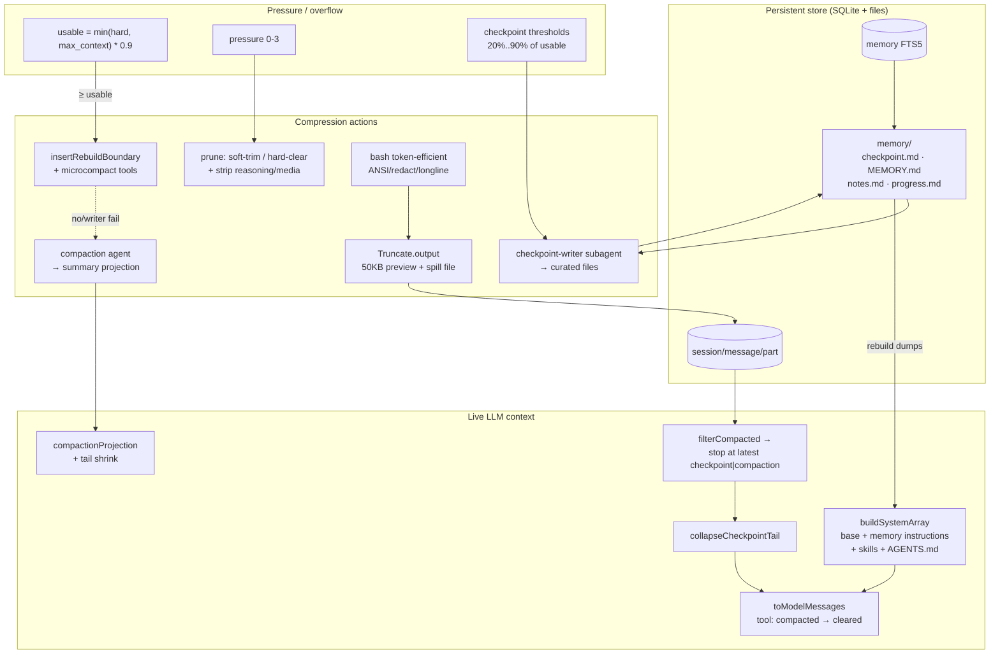

# F2 — MiMo-Code

Local source-only research on Xiaomi MiMo-Code (`H:\MiMo-Code`, monorepo engine package `packages/opencode`). Fork/derivative of OpenCode-style agent engine ("Where Models and Agents Co-Evolve"), reimplemented around Effect-TS, SQLite persistence, and a dual-tier context system: **checkpoint rebuild** (preferred) + **LLM summarization compaction** (fallback).

Primary code root: `H:\MiMo-Code\packages\opencode\src\`

---

## Architecture overview

MiMo-Code separates **durable transcript storage** from **live LLM prompt context**:

| Layer | What it is | Where |
| --- | --- | --- |
| Persistent transcript | SQLite `session` / `message` / `part` tables; full history never deleted by compaction | `session/session.sql.ts`, `storage/` |
| Effective context | Projection from the newest `compaction` or `checkpoint` boundary forward | `session/message-v2.ts` (`filterCompacted`, `compactionProjection`) |
| System prompt | Assembled once per request profile; frozen into `session_prefix_snapshot` | `session/llm.ts` (`buildSystemArray`), `session/prefix-snapshot.ts` |
| On-disk memory | `MEMORY.md`, `checkpoint.md`, `notes.md`, per-task `progress.md` + FTS index | `memory/`, `session/checkpoint*.ts` |
| History / trajectory | Separate search tool over full DB (`history` tool); trajectory export is field-faithful but uses the same compacted slice | `tool/history.ts`, `session/trajectory.ts` |

Two compression philosophies coexist:

1. **Checkpoint rebuild** (preferred when enabled): a background `checkpoint-writer` subagent curates structured state into `checkpoint.md` + `MEMORY.md` + `notes.md`. On overflow, a synthetic `checkpoint` user-part boundary is inserted; live context becomes "rebuild dumps + preserved tail", and tool results after the watermark are microcompacted.
2. **Compaction** (fallback / when checkpoints disabled): a `compaction` agent summarizes history into an assistant summary, stored as a projection on a synthetic `compaction` user-part. Overflow also strips media.

Plus continuous **prune** / **soft-trim** of old tool outputs based on pressure level and provider cache TTL.

---

## Context assembly pipeline

Per request (main runLoop in `session/prompt.ts`):

```
messages = MessageV2.filterCompactedEffect(sessionID, {agentID, contextFrom, contextWatermark})
  → stream newest-first until a user row with checkpoint|compaction part
  → reverse
  → compactionProjection (rewrite effective view for latest v1 compaction)

optional collapseCheckpointTail(msgs)
  → drop assistant messages in (coveredUpTo, digestUpTo] after latest checkpoint boundary
  → user messages always stay live

toModelMessages(msgs, model, {stripMedia?, collapseCheckpointTail?})
  → checkpoint part → text "Summary of previous conversation from checkpoint files:"
  → legacy compaction part without projection → "Summary of previous conversation:"
  → tool state: if time.compacted → output "[Old tool result content cleared]", attachments dropped

system = buildSystemArray({
  agent prompt (or replace-agent session system),
  + memory instructions (main/peer only),
  + orchestrator fleet roster (orchestrator only),
  + plugin transform,
  + additions: env / structured-output / skill catalog / AGENTS.md+CLAUDE.md instructions
}) → collapsed to ONE system message joined by \n\n

turn context (user.system) → user message <system-reminder>…</system-reminder>
```

System additions at prompt site (`prompt.ts` ~4731):

- `SystemPrompt.environment` (dynamic, flag-gated)
- `SystemPrompt.skills` (skill catalog)
- `Instruction.system()` — project `AGENTS.md` (first match wins up worktree), sparse AGENTS.md also pulls `CLAUDE.md` if <500 chars, global `AGENTS.md` / `~/.claude/CLAUDE.md`, config `instructions` files+URLs
- Nested `AGENTS.md`/`CLAUDE.md` near a read file can be attached once per assistant message via `Instruction.resolve`

Prefix caching: `session_prefix_snapshot` freezes system+tool hashes so compaction/checkpoint can rebuild with the same advertised tools/system (`SessionPrefixSnapshot`).

---

## Token budget & thresholds

### Token estimation
`util/token.ts`: **chars/4** heuristic (`Token.estimate`). `parseQuantity` accepts plain numbers, `"300K"`/`"1.5M"`, or `"50%"` of a relative total.

### Window arithmetic (`session/overflow.ts`)
```
hard      = model.limit.input || model.limit.context   (0 = unknown → overflow off)
reserved  = cfg.compaction.reserved ?? min(33_000, maxOutputTokens(model))
outputRes = model.limit.input ? 0 : min(maxOutputTokens, 20_000)   // OUTPUT_CAP
budget    = cfg.compaction.max_context / MIMOCODE_COMPACTION_MAX_CONTEXT
            (number | "300K" | "50%" | map keyed "<provider>/<model>" with wildcards)
            clamped: can only LOWER hard; 0 restores model default
effective = configured ?? hard
usable    = floor(effective * MIMOCODE_COMPACTION_TRIGGER_RATIO)   // default 0.9
```

- **Compaction trigger**: `isOverflow` when `tokens.total` (or input+output+cache) ≥ `usable`.
- **Pressure levels** (`contextPressureLevel`): 0 if <50% of usable; 1 if <70%; 2 if <85%; 3 otherwise.
- Env flags (`flag/flag.ts`):
  - `MIMOCODE_COMPACTION_MAX_CONTEXT`
  - `MIMOCODE_COMPACTION_TRIGGER_RATIO` (default 0.9)
  - `MIMOCODE_DISABLE_AUTOCOMPACT`, `MIMOCODE_DISABLE_CHECKPOINT`

### Compaction constants (`session/compaction.ts`)
| Constant | Value | Role |
| --- | --- | --- |
| `COMPACTION_BUFFER` | 33_000 | Default reserved headroom for summary generation |
| `COMPACTION_TAIL_BUDGET` | 40_000 | Max tokens of post-boundary API rounds kept during compaction |
| `COMPACTION_TOOL_RESULT_LIMIT` | 8_000 | Tool results above this are replaced with omit placeholder in the kept tail |
| `FILE_MANIFEST_LIMIT` | 5 | Files listed in `<files-touched>` after compaction |
| `PRUNE_MINIMUM` | 20_000 | Min estimated tokens before hard prune applies |
| `PRUNE_PROTECT` | 40_000 | Most recent tool-output tokens protected from prune |

### Checkpoint / prune constants (`session/prune.ts`, `checkpoint.ts`)
| Constant | Value | Role |
| --- | --- | --- |
| `SOFT_TRIM_THRESHOLD` | 4096 | Soft-trim only tool outputs longer than this |
| `SOFT_TRIM_KEEP_HEAD` / `_TAIL` | 1536 | Head/tail chars kept after soft trim |
| `CHECKPOINT_RESERVED` | 13_000 (config schema says default 20000) | Safety buffer: thresholds clamped to window−reserved |
| `TAIL_MIN_TOKENS` / `TAIL_MAX_TOKENS` | 10_000 / 20_000 | Checkpoint rebuild preserved-tail budget |
| `TAIL_MIN_TEXT_BLOCK_MESSAGES` | 5 | Min text-bearing messages in preserved tail |
| `REBUILD_WAIT_MS` | 30s | Rebuild waits for in-flight writer |
| `FIRST_CHECKPOINT_WAIT_MS` | 5 min | First writer wait when no watermark |
| Manual / auto writer wait | 5 min / 3 min | `rebuildEnsuringCheckpoint` |
| Default checkpoint thresholds | <25K: none; ≤200K: 20/40/60/80%; ≤500K: 10–90% @10%; >500K: 18×5% | Fire background writers mid-turn |

### Other budgets
- Checkpoint section budgets (~11K total): §1 500 … §10 3000 … (`checkpoint-templates.ts`)
- MEMORY.md section budgets ~10K
- Rebuild dumps: `readBudgeted` / `readBudgetedSectionAware` with configurable caps (checkpoint ~11K, notes/global ~6K, recent user 16K / 2K per msg)
- Tool preview: `MAX_LINES=2000`, `MAX_BYTES=50*1024`; `pressureCaps` halves both
- History tool output budget: 19_500 bytes
- Bash token-efficient long lines: 500 chars → keep 160 head

---

## Compression mechanisms

### 1. Checkpoint rebuild (preferred)
**Write path** (`prune.fireCheckpoints` + `checkpoint.tryStartCheckpointWriter`):
- Each runLoop iteration, if actor `servesCheckpoint` (main/peer, not system-spawned) and token count crosses a threshold, fork a `checkpoint-writer` subagent.
- Writer extracts conversation into `sessions/<sid>/checkpoint.md` (11 sections), may promote durable facts to `projects/<pid>/MEMORY.md`, reconciles `notes.md` / per-task `progress.md`.
- Session row stores `last_checkpoint_message_id` (watermark).

**Rebuild path** (`prompt.rebuildFromCheckpoint` → `checkpoint.insertRebuildBoundary`):
1. Require on-disk checkpoint + watermark.
2. Insert synthetic **user** message with `checkpoint` part (`coveredUpTo=boundary`, optional `digestUpTo`).
3. Append synthetic text parts: index overview + `renderRebuildContext` dumps (tasks ledger, checkpoint body, active actors, recent verbatim user input, MEMORY.md, global MEMORY.md, notes.md, memory keys index, recent-activity digest).
4. `filterCompacted` stops at this boundary → all older DB rows vanish from the model view **without deletion**.
5. **Tail microcompact**: for messages strictly newer than boundary, stamp `state.time.compacted` on completed tool parts whose tool ∈ `COMPACTABLE_TOOL_NAMES` (read, view_image, bash, grep, glob, webfetch, websearch, edit, write, multiedit, apply_patch, codesearch). Converter later emits `[Old tool result content cleared]`.
6. Send-time `collapseCheckpointTail` folds the covered assistant tail into the already-written activity log so hollow tool_results don't look live.

**Rebuild vs compact policy** (`rebuildEnsuringCheckpoint`):
- `memory.disable_write` → compact (and say so)
- `MIMOCODE_DISABLE_CHECKPOINT` → compact
- Existing checkpoint → rebuild (do not wait for fresher in-flight writer)
- No checkpoint → start writer, wait bounded; on failure → compact
- Checkpoint exists but insert failed → do **not** compact (honest degraded state)

### 2. LLM compaction (`session/compaction.ts`)
Triggers: manual `/compact`, automatic when last user has a `compaction` part, provider overflow.

**Create**: synthetic user message + `compaction` part (`auto`, `overflow`).

**Process**:
- Run `compaction` agent over `MessageV2.toModelMessages(..., {stripMedia|collapseCheckpointTail})` + summarization prompt.
- On overflow of the summary itself: try strip media / replay last user / rollback.
- Build **projection v1** on the compaction part:
  - `summary_message_id`, `summary` text wrapped as `<conversation-summary trigger="…">`
  - optional `<files-touched>` manifest (last 5 files with read/edit labels)
  - `tail_start_id` / `tail_end_id`: whole API rounds that arrived during compaction, budgeted by `COMPACTION_TAIL_BUDGET`, after `shrinkLargeToolResults` (>8K token tool outputs → omit placeholder)
  - `compacted_tool_calls`: call_id → original tokens for those shrunk results
- `compactionProjection` rewrites the model view as: boundary + summary + (shrunk tail) + later live traffic.
- Auto-continue: synthetic user "Continue if you have next steps…" (or replay last real user on overflow, with media replaced by `[Attached mime: filename]`).

### 3. Prune / soft-trim (`prune.ts` + `compaction.prune`)
Gate: `compaction.prune` enabled, provider **cache cold** (now − lastAssistant > model.cacheTTL ?? 300s), pressure > 0.

Walk backward from newest user turn, skip last turn and protected tools (`skill`), accumulate tool-output estimates:

- **Pressure 1 (soft)**: for tool outputs >4096 chars, rewrite as head 1536 + marker + tail 1536.
- **Pressure 2+ (hard)**: if pruned estimate >20K, stamp `time.compacted` (DB keeps original output; model view becomes cleared).
- **Pressure 2+ stripNonEssential**: blank assistant `reasoning` text; replace media file URLs with `[stripped: filename]` (protects last 3 turns).

### 4. Projection-only shrink (no DB mutation)
`compactionProjection` / `buildTail` replace large tool outputs in the **model message array** with:
`[Tool result omitted during compaction: N tokens. Re-run "<tool>" if this result is needed.]`
Original rows remain in SQLite.

---

## Tool output handling

| Stage | Mechanism | Cap |
| --- | --- | --- |
| Capture | `tool/truncate.ts` `Truncate.output` | `previewToolOutput`: 2000 lines / 50KB; head+tail if error-like tail (`error\|failed\|…` in last 2048 chars); else head |
| Overflow spill | Full text written to truncation dir (`tool_…`), hint to model: use `actor` (explore agent) or Grep/Read offset; 7-day retention | |
| Pressure | `pressureCaps` halves line/byte budget | 1000 / 25KB |
| Bash (experimental) | `MIMOCODE_EXPERIMENTAL_TOKEN_EFFICIENCY`: progress `\r` collapse, ANSI strip, secret redaction (PEM/JWT/AWS/GH/OpenAI/Anthropic/Slack), long-line 500→160; never-worse rollback; TUI/disk keep raw | flag off by default |
| Compaction tail | Results >8K tokens omitted | 8K |
| Rebuild microcompact | Whitelisted tools' results cleared after boundary | |
| Soft-trim | Head+tail 1.5K if >4096 chars | |
| Hard prune | `time.compacted` → `[Old tool result content cleared]` | |
| History tool | Search/around/get with 19.5K byte budget; `get` pages original part text | |
| Read tool | Line/offset truncation markers; giant lines cut to `MAX_LINE_LENGTH` | |

---

## Memory & notes integration

### File layout (under `Global.Path.data/memory/`)
```
global/MEMORY.md
projects/<sha256(repoPath)[:12]>/MEMORY.md
sessions/<sessionID>/checkpoint.md          # 11-section structured state
sessions/<sessionID>/notes.md               # free-form scratchpad
sessions/<sessionID>/checkpoint-<topic>.md  # spillover
sessions/<sessionID>/tasks/<taskID>/progress.md
sessions/<sessionID>/tasks/<taskID>/notes.md
```

### Roles
- **Checkpoint-writer** (system subagent): sole curator of checkpoint.md / progress; may promote to MEMORY.md.
- **Main agent**: may Edit MEMORY.md for explicit rules/architecture/durable facts; only legal scratchpad is notes.md; must not invent other memory files (path guard `tool/memory-path-guard.ts`).
- **Search**: `memory` tool → SQLite FTS5 BM25 over reconciled markdown (`memory/service.ts`, relative score floor 0.15).
- **Write gate**: `memory.disable_write` stops all new writes AND automatic injection (rebuild short-circuits to compaction); existing files stay readable.

### Injection
- **System prompt** (main/peer): `buildMemoryInstructions` always teaches paths/ownership; checkpoint-on adds writer-curated files + "Active recall protocol" (dumps already in rebuild message — don't re-Read whole files).
- **Rebuild message**: budgeted section-aware dumps of checkpoint/MEMORY/global/notes + tasks ledger + memory keys index + recent user quotes.
- **High pressure**: optional nudge to save learnings (suppressed when write disabled).

### Checkpoint.md template (11 sections)
§1 Active intent · §2 Next concrete action · §3 Directives · §4 Task tree · §5 Current work · §6 Files · §7 Discovered knowledge · §8 Errors · §9 Live resources · §10 Design decisions · §11 Open notes  
Section token budgets total ~11K.

---

## Persistence

### SQLite (primary)
- `session`: id, project_id, parent_id, **context_from**, **context_watermark**, title, prompt (system/systemMode/harness), **last_checkpoint_message_id**, time_compacting, revert, permission
- `session_prefix_snapshot`: frozen system[] + tools for a (session, profile_key)
- `message`: id, session_id, **agent_id** (main vs subagent slices), `data` JSON (User|Assistant info including tokens/cost/summary flag)
- `part`: id, message_id, session_id, `data` JSON (text|tool|compaction|checkpoint|file|reasoning|…)
- `memory_fts` / `memory_fts_idx`: FTS index of memory markdown

### File / JSON
- Memory markdown tree (above)
- Legacy `Storage` JSON under data dir (`session_diff`, etc.)
- Truncation artifacts for oversized tool outputs
- Git snapshots for diffs (`session/summary.ts` is diff summary, not LLM compaction)

### Invariants
- Compaction/checkpoint **never delete** message/part rows; they insert boundary markers and change *projections* / `time.compacted` stamps.
- `filterCompacted` is the sole "what the model sees" function; UI/history can opt out with `agentID: "*"`.
- Child sessions inherit parent main-thread context up to `context_watermark`.

---

## History/trajectory vs live prompt

| Concern | Live prompt | History / trajectory |
| --- | --- | --- |
| Source | `filterCompactedEffect` + projections + collapseCheckpointTail | Full DB stream (`agentID:"*"` for export) |
| Tool results | Cleared / omitted / soft-trimmed as above | Original `state.output` still stored |
| History tool | — | FTS search / around / get(part_id); 19.5K response budget |
| Trajectory export | Must pass the **same compacted slice** for replay parity (`trajectory.ts` docs) | Field-faithful spread of MessageV2; only `data:` URLs summarized |
| Plugin chat transform | `experimental.chat.messages.transform` before model conversion | DB unchanged |

---

## Key code snippets

### Effective context cutoff
```ts
// message-v2.ts
export function filterCompacted(msgs: Iterable<WithParts>) {
  const result = [] as WithParts[]
  for (const msg of msgs) {
    result.push(msg)
    if (msg.info.role === "user" &&
        msg.parts.some((p) => p.type === "checkpoint" || p.type === "compaction")) break
  }
  result.reverse()
  return compactionProjection(result)
}
```

### Compaction trigger
```ts
// overflow.ts
const count = tokens.total || tokens.input + tokens.output + tokens.cache.read + tokens.cache.write
return count >= usable({ cfg, model })  // usable = effective * 0.9 by default
```

### Soft trim / hard prune
```ts
// prune.ts — pressure 1
part.state.output = output.slice(0, 1536) + "\n\n[... trimmed — kept first and last 1.5K …]\n\n" + output.slice(-1536)
// pressure 2
part.state.time.compacted = Date.now()  // model view → "[Old tool result content cleared]"
```

### Compaction tail tool shrink
```ts
// compaction.ts
output: `[Tool result omitted during compaction: ${tokens} tokens. Re-run "${part.tool}" if this result is needed.]`
```

### Rebuild microcompact whitelist
```ts
const COMPACTABLE_TOOL_NAMES = new Set([
  "read","view_image","bash","grep","glob","webfetch","websearch",
  "edit","write","multiedit","apply_patch","codesearch",
])
```

### Tool preview budget
```ts
export const MAX_LINES = 2000
export const MAX_BYTES = 50 * 1024
// head+tail when ERROR_PATTERN matches last 2048 chars; else head
```

---

## Mermaid diagram suggestion



---

## Confidence notes

**High confidence** (read primary implementation):
- Overflow/window math, trigger ratio 0.9, max_context budget grammar
- Compaction projection v1, tail budget 40K, tool-result 8K omit, file manifest 5
- Prune soft-trim (4096/1536) and hard compact stamps; protected tool `skill`
- Checkpoint writer thresholds, rebuild boundary insert, microcompact whitelist, tail digest collapse
- Tool truncate 50KB/2000 lines + spill-to-file + explore-agent hint
- System array assembly order and memory instruction injection for main/peer
- SQLite schema and "never delete history" projection model
- Memory path layout and FTS search tool

**Medium confidence**:
- Exact interaction of every pressure level with each prune path in long sessions (complex runLoop; documented in comments more than single function)
- Whether `checkpoint.reserved` default is 13_000 (prune.ts `CHECKPOINT_RESERVED`) vs config schema description "Default: 20000" — code uses 13_000 unless `cfg.checkpoint.reserved` set
- Prefix-cache freezing details under concurrent subagent slices (many comments; not exhaustively traced)
- Desktop/MiMo Desktop UI only surfaces these mechanisms; engine is packages/opencode

**Out of scope / not found as a separate system**:
- No independent embedding-based context store beyond FTS5 BM25 memory search
- No automatic recursive hierarchical summarization tree (single latest boundary + optional file-backed checkpoint)
- Token Efficient Mode is experimental and default-off

**Repo identity note**: Engine is OpenCode-derived (`packages/opencode`), rebranded MiMo Code / mimocode home paths (`resolveMimocodeHome`, `MIMOCODE_*` flags). Docs in `docs/compose/spec/context-budget-control.md` and `docs/harness/MiMo Token Efficient Mode*.md` match the code constants.
