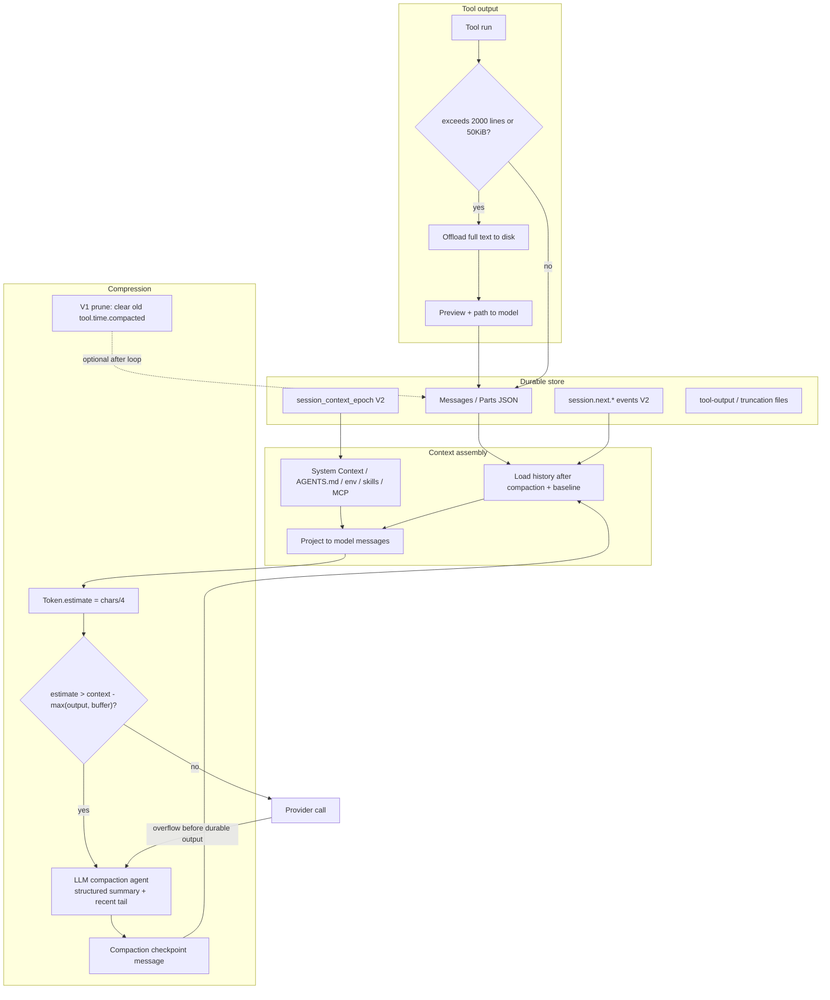

# F3 — OpenCode

Local source-only research of anomalyco/opencode (H:\opencode). Dual runtime: **V1** lives in `packages/opencode` (file/SQLite-backed, production path); **V2** lives in `packages/core` (event-sourced SQLite + Context Epoch). Both implement LLM-summarization compaction plus tool-output bounding.

---

## Architecture overview

OpenCode keeps **durable full transcript** and changes only the **active model-visible projection**.

| Layer | Role |
| --- | --- |
| Session / Message / Part (V1) or SessionMessage (V2) | Durable history |
| Context Epoch (V2) / system prompt assembly (V1) | Provider-cache baseline + mid-conversation updates |
| Compaction | Rolling structured summary + recent verbatim tail |
| Prune (V1) / ToolOutputStore / Truncate (both) | Tool-output elision |
| `Token.estimate` | chars/4 heuristic (no real tokenizer) |

Key packages:

- `packages/opencode` — V1 session runtime (`src/session/*`, `src/tool/truncate.ts`)
- `packages/core` — V2 session runner + shared config (`src/session/*`, `src/tool-output-store.ts`)
- `packages/llm` — provider transport / request types
- `packages/schema` — durable message / event schemas
- Root `CONTEXT.md` and `specs/v2/session.md` document the intended V2 model

---

## Context assembly pipeline

### V1 (`packages/opencode/src/session/prompt.ts`)

1. Load messages via `MessageV2.filterCompactedEffect(sessionID)` — reorders to `[compaction-user, summary, ...retained tail..., continue]`.
2. Optional auto-continue synthetic user text after compaction.
3. Build system array: env facts + AGENTS/CLAUDE/CONTEXT instructions + MCP instructions + skills.
4. Convert via `MessageV2.toModelMessagesEffect` → AI SDK model messages.
5. Provider-specific base prompt selected by model id (`session/system.ts`).
6. Loop: overflow check → compact task → tools → stream → prune forked at end of loop.

### V2 (`packages/core/src/session/runner/llm.ts`)

1. `SessionContextEpoch.initialize|prepare` renders System Context baseline (env, date, AGENTS.md).
2. `SessionHistory.entriesForRunner` loads messages after latest compaction seq and after baseline_seq (system mid-updates after baseline only).
3. `compactIfNeeded` estimates full request vs budget; if over, `compactAfterOverflow`, then die/continue to rebuild.
4. `LLM.request({ system: [agent.system, epoch.baseline], messages: toLLMMessages(...) })`.
5. Provider overflow before durable output → one-shot `compactAfterOverflow` recovery.

---

## Token budget & thresholds

| Constant | Value | Where | Meaning |
| --- | --- | --- | --- |
| `CHARS_PER_TOKEN` | 4 | `packages/core/src/util/token.ts` | Token estimate = round(len/4) |
| `DEFAULT_BUFFER` / `COMPACTION_BUFFER` | 20_000 | core compaction.ts, opencode overflow.ts | Reserved headroom before auto-compact |
| `DEFAULT_KEEP_TOKENS` | 8_000 | core compaction.ts | Recent-tail budget (V2 keep.tokens default) |
| `MIN_PRESERVE_RECENT_TOKENS` | 2_000 | opencode compaction.ts | V1 min verbatim tail |
| `MAX_PRESERVE_RECENT_TOKENS` | 15_000 | opencode compaction.ts | V1 max verbatim tail |
| V1 preserve default | `clamp(0.25 * usable, 2k, 15k)` | `preserveRecentBudget` | Dynamic tail budget |
| `SUMMARY_OUTPUT_TOKENS` | 4_096 | core compaction.ts | Cap on summarizer maxTokens |
| `TOOL_OUTPUT_MAX_CHARS` | 2_000 | both compaction serializers | Tool text inside summary prompt |
| `PRUNE_MINIMUM` | 20_000 | opencode compaction.ts | Min freeable tokens before prune applies |
| `PRUNE_PROTECT` | 40_000 | opencode compaction.ts | Keep this many recent tool tokens unpruned |
| `MAX_LINES` / `MAX_BYTES` | 2000 / 50 KiB | truncate.ts, tool-output-store.ts | Tool-output disk-offload bounds |
| `tool_output.max_lines/max_bytes` | config | V1 config | Override those bounds |

### Budget formulas

**V1 overflow (`overflow.ts`)**

```
usable =
  if model.limit.input: max(0, input - reserved)
  else: max(0, context - maxOutputTokens(model))
reserved = cfg.compaction.reserved ?? min(20000, maxOutputTokens(model))

isOverflow: tokens.total (or sum of input+output+cache) >= usable
```

**V2 auto-compact (`core/session/compaction.ts` compactIfNeeded)**

```
estimate({system, messages, tools}) <= context - max(outputAllowance, buffer)  → no compact
else compactAfterOverflow
```

Config schema (V2 `config/compaction.ts`; V1 `v1/config/config.ts`):

```
compaction: { auto?: bool, prune?: bool, keep?: { tokens?: int }, buffer?: int }
// V1 legacy names: preserve_recent_tokens, reserved, tail_turns
```

---

## Compression mechanisms

### 1. Auto + overflow LLM compaction (both)

- Dedicated hidden **compaction agent** (`agent.ts` + `agent/prompt/compaction.txt`): “You are a context summarization agent… only output the structured summary”.
- Shared **summary template** in `core/session/compaction.ts` (`SUMMARY_TEMPLATE`): Objective / Important Details / Work State (Completed|Active|Blocked) / Next Move / Relevant Files.
- **Incremental update**: `SUMMARY_UPDATE_INSTRUCTIONS` — prior summary + new conversation, conversation wins on conflict.
- Conversation is serialized to text (`[User]:`, `[Assistant]:`, `[Assistant tool call]:`, `[Tool result]:` truncated to 2k chars).
- Split: walk turns (or serialized lines in V2 core) from the end until `keep.tokens` budget; older half → summary, recent half kept verbatim (`recent` / `tail_start_id`).

### 2. V1 overflow replay

On provider overflow (`processor` result `"compact"` or `isOverflow` after finish):

- Create user message with `type: "compaction"` part (`create`).
- `process` builds summary from head, stores assistant summary message (`mode: "compaction"`, `summary: true`).
- If overflow: rewind to previous non-compaction user turn, strip media to text placeholders, replay that user turn after the checkpoint.
- Else inject synthetic continue user text (`metadata.compaction_continue: true`) unless plugin disables via `experimental.compaction.autocontinue`.

### 3. V2 Context Epoch after compaction

- Completed `session.next.compaction.ended.1` projects a `SessionMessage.Compaction` (`{summary, recent, reason}`).
- Next provider turn: `SessionContextEpoch` sees latest compaction seq > baseline_seq → `SystemContext.replace` → fresh baseline; history loader drops pre-compaction rows.
- Compaction is re-projected to the model as a user message wrapping `<conversation-checkpoint>` with `<summary>` + `<recent-context>` (`to-llm-message.ts`).

### 4. V1 prune (tool-output wipe)

- Opt-in `compaction.prune` (default false).
- Walk parts backwards; protect last ~40k tokens of tool output; older completed tool parts get `state.time.compacted = Date.now()` (in-place mutation of durable part JSON).
- Only if freeable > 20k tokens. Protected tools: `["skill"]`.
- Compacted tools serialize as `"[Old tool result content cleared]"` in both summary text and model messages.
- Forked at end of V1 prompt loop.

### 5. Manual compact

- HTTP: session summarize/compact handler calls `SessionCompaction.create({ auto: false })` then `prompt.loop`.
- Spec notes V2 manual compaction is still a follow-up; auto + overflow are complete.

### 6. Message filter reorder (V1)

`filterCompacted` reorders for model consumption so checkpoint + retained tail appear after the summary; durable array order stays chronological.

---

## Tool output handling

### Capture-time (before durable store)

| Mechanism | Package | Behavior |
| --- | --- | --- |
| `Truncate.output` | opencode `src/tool/truncate.ts` | If lines>2000 or bytes>50KiB: write full text to truncation dir (`tool_<id>`), return head preview + “…N lines/bytes truncated…” + path hint. Retention 7 days. |
| `ToolOutputStore.bound` | core `src/tool-output-store.ts` | Same limits; head+tail preview with mid-marker `... output truncated; full content saved to PATH ...`. Media attachments kept. |
| Per-tool | shell/read/grep/glob | Tool-specific limits + markers. |
| Config | `tool_output.max_lines`, `tool_output.max_bytes` | Overrides. |

### Model-replay-time

| Mechanism | Behavior |
| --- | --- |
| `truncateToolOutput(text, maxChars)` in message-v2 | Optional `toolOutputMaxChars` when converting to model messages |
| Compaction serialize | Always 2k chars + `[truncated]` |
| Pruned parts | `"[Old tool result content cleared]"` |
| Media in tool results | Providers without media-in-tool support: extracted into synthetic user attachment message |

CONTEXT.md: provider-executed tool results stay provider-native; bounding is provider-independent; token pressure is compaction’s job.

---

## Persistence

### V1

- SQLite tables shared with core schema: `session`, `message` (JSON `data`), `part` (JSON `data`).
- Legacy file layout still referenced in `storage/storage.ts` migrations: `storage/session/info/*.json`, `storage/session/message/<sid>/*.json`, `storage/session/part/<sid>/<mid>/*.json`.
- Compaction durable as:
  - user message + part `{ type: "compaction", auto, overflow?, tail_start_id? }`
  - assistant message `{ mode: "compaction", agent: "compaction", summary: true }` with text parts = structured summary.
- Prune mutates part JSON in place (`time.compacted`).

### V2 (event-sourced)

- `session_message` table: `id`, `session_id`, `type`, `seq`, `data` JSON.
- Compaction events: `session.next.compaction.started.1` (durable identity), `.delta` (live-only), `.ended.1` (durable `{messageID, text, recent, reason}`).
- Projection (`message-updater.ts`) appends `SessionMessage.Compaction`.
- `session_context_epoch` table: `baseline` text, `snapshot` JSON of SystemContext sources, `baseline_seq`.
- Full history preserved; compaction only changes projected runner context (`history.ts` filters `seq >= latestCompaction.seq` plus system messages after baseline).

### Compaction message / part types

```ts
// V1 CompactionPart (schema/v1/session.ts)
{ type: "compaction", auto: boolean, overflow?: boolean, tail_start_id?: MessageID }

// V2 SessionMessage.Compaction (schema/session-message.ts)
{ type: "compaction", reason: "auto" | "manual", summary: string, recent: string }
```

---

## Key code snippets

### Token estimate

```ts
// packages/core/src/util/token.ts
const CHARS_PER_TOKEN = 4
export const estimate = (input: string) => Math.max(0, Math.round(input.length / CHARS_PER_TOKEN))
```

### V1 overflow usable budget

```ts
// packages/opencode/src/session/overflow.ts
const COMPACTION_BUFFER = 20_000
export function usable({ cfg, model, outputTokenMax }) {
  const reserved =
    cfg.compaction?.reserved ??
    Math.min(COMPACTION_BUFFER, ProviderTransform.maxOutputTokens(model, outputTokenMax))
  return model.limit.input
    ? Math.max(0, model.limit.input - reserved)
    : Math.max(0, context - ProviderTransform.maxOutputTokens(model, outputTokenMax))
}
```

### V2 auto-compact gate

```ts
// packages/core/src/session/compaction.ts compactIfNeeded
if (
  estimate({ system, messages, tools }) <=
  context - Math.max(output, config.buffer)
) return false
return yield* compactAfterOverflow(input)
```

### Summary template (abbreviated)

```
## Objective
## Important Details
## Work State
### Completed / ### Active / ### Blocked
## Next Move
## Relevant Files
```

### V2 checkpoint → LLM

```ts
// packages/core/src/session/runner/to-llm-message.ts
case "compaction":
  return [Message.make({
    role: "user",
    content: `<conversation-checkpoint>
<summary>${message.summary}</summary>
<recent-context>${message.recent}</recent-context>
</conversation-checkpoint>`,
  })]
```

### Tool capture bound

```ts
// packages/opencode/src/tool/truncate.ts
export const MAX_LINES = 2000
export const MAX_BYTES = 50 * 1024
// full text → TRUNCATION_DIR/tool_<id>; preview returned to model
```

### Compaction agent

```ts
// packages/opencode/src/agent/agent.ts
compaction: {
  name: "compaction", mode: "primary", native: true, hidden: true,
  prompt: PROMPT_COMPACTION,
  permission: { "*": "deny" },
}
```

### Instruction injection (V1)

```ts
// packages/opencode/src/session/instruction.ts
globalFiles = [global.config/AGENTS.md, ~/.claude/CLAUDE.md]
instructionFiles = ["AGENTS.md", "CLAUDE.md", "CONTEXT.md"] // CONTEXT.md deprecated
// first project-level match wins; config.instructions globs/URLs also loaded
// nested: on read tool, walk up from file dir and attach nearby instruction files once per message
```

### Instruction injection (V2)

```ts
// packages/core/src/instruction-context.ts
// SystemContext key "core/instructions": global + upward AGENTS.md under project root
// baseline: "Instructions from: <path>\n<body>"
// update: "These instructions replace all previously loaded ambient instructions.\n\n..."
```

---

## Mermaid diagram suggestion



---

## Confidence notes

| Area | Confidence | Notes |
| --- | --- | --- |
| Dual V1/V2 compaction implementations | High | Both files fully read |
| Threshold constants and budget math | High | Constants and formulas directly in source |
| Token estimate = chars/4 | High | Trivial; no real tokenizer |
| V1 overflow replay / auto-continue / prune | High | Full compaction.ts + prompt loop + processor |
| V2 Context Epoch + event projection | High | context-epoch, history, message-updater, to-llm-message, runner/llm |
| Tool truncation offload | High | truncate.ts + tool-output-store.ts |
| Instruction / AGENTS.md injection | High | instruction.ts + instruction-context.ts + builtins |
| Persistence format | High | sql.ts tables; V1 also uses same SQLite schema; legacy JSON migration paths present |
| Manual compact completeness in V2 | Medium | Spec lists manual compaction as follow-up; V1 HTTP summarize exists |
| Deterministic old tool-result pruning in V2 | Medium | Spec defers it; only V1 prune implemented |
| Whether production default is V1-only | Medium | Both packages present; V1 is the mature agent loop with prune + overflow replay; V2 runner is the redesign |

Primary files:

- `H:\opencode\packages\opencode\src\session\compaction.ts`
- `H:\opencode\packages\opencode\src\session\overflow.ts`
- `H:\opencode\packages\opencode\src\session\message-v2.ts`
- `H:\opencode\packages\opencode\src\session\prompt.ts`
- `H:\opencode\packages\opencode\src\session\instruction.ts`
- `H:\opencode\packages\opencode\src\session\system.ts`
- `H:\opencode\packages\opencode\src\tool\truncate.ts`
- `H:\opencode\packages\core\src\session\compaction.ts`
- `H:\opencode\packages\core\src\session\context-epoch.ts`
- `H:\opencode\packages\core\src\session\history.ts`
- `H:\opencode\packages\core\src\session\runner\llm.ts`
- `H:\opencode\packages\core\src\session\runner\to-llm-message.ts`
- `H:\opencode\packages\core\src\system-context\index.ts`
- `H:\opencode\packages\core\src\instruction-context.ts`
- `H:\opencode\packages\core\src\tool-output-store.ts`
- `H:\opencode\packages\core\src\util\token.ts`
- `H:\opencode\CONTEXT.md`
- `H:\opencode\specs\v2\session.md`
