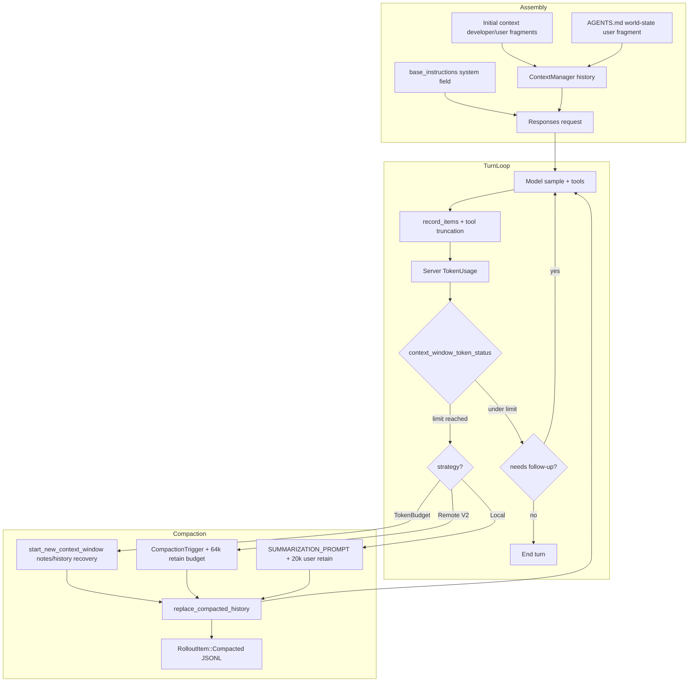

# F4 — Codex CLI

Local source-only research of `openai/codex` at `H:\codex`. Core agent logic lives in `codex-rs` (Rust). `codex-cli` is a thin npm wrapper around the Rust binary; the older TypeScript CLI is not the active context-management implementation.

Primary crates:
- `codex-rs/core` — session, turn loop, compaction, context assembly
- `codex-rs/context_manager` — in-memory conversation history + token estimates
- `codex-rs/prompts` — compaction prompts
- `codex-rs/rollout` + `codex-rs/history` — JSONL session persistence
- `codex-rs/utils/output-truncation` + `codex-rs/utils/string` — tool-output truncation
- `codex-rs/models-manager/models.json` — per-model context windows / policies
- `codex-rs/protocol` — `ResponseItem`, `TruncationPolicy`, `ModelInfo`

---

## Architecture overview

Codex keeps a single **append-only conversation history** of `ResponseItem` envelopes (API-shaped messages, function calls/outputs, agent messages, contextual fragments). Context management is layered:

1. **Always-on tool-output truncation** when items are recorded into history.
2. **Initial-context injection** (developer + AGENTS.md user fragments) rebuilt/diffed against a `reference_context_item` baseline.
3. **Token accounting** from server-observed usage (primary) and byte-heuristic estimates (secondary).
4. **Auto-compaction / rollover** when scoped token budgets or the full context window are hit.
5. **Three compaction strategies**:
   - **Local summarizing compaction** (extra model call with a checkpoint prompt).
   - **Remote Compaction V2** (Responses API `CompactionTrigger` item; server returns a compaction artifact).
   - **Token-budget window reset** (feature-gated; no summary; install a fresh context window and recover via `notes`/`history` tools).

There is also a **Guardian / security-review** path that can force compaction when review evidence overflows.

### Key data structures

| Concept | Location | Role |
|---|---|---|
| `ContextManager` | `core/src/context_manager/history.rs` | Live history: `Arc<Vec<ResponseItemEnvelope>>`, token info, retained context, guardian history, `reference_context_item`, world-state baseline |
| `ResponseItemEnvelope` | `history/src/lib.rs` | `ResponseItem` + harness metadata (history truncation overrides, client-authored flags) |
| `Prompt` | `core/src/client_common.rs` | Model request: `input: Vec<ResponseItem>`, tools, `base_instructions` |
| `AutoCompactWindow` | `core/src/state/auto_compact_window.rs` | Window number/IDs, prefill baseline, reminder/fallback claims |
| `ContextWindowTokenStatus` | `core/src/session/context_window.rs` | Active tokens, scoped tokens, full-window limit, `token_limit_reached` |
| `CompactedItem` | `history/src/lib.rs` | Persisted compaction checkpoint (replacement history + window IDs) |
| `WorldState` | `core/src/context/world_state/` | Model-visible persistent state sections (AGENTS.md, token-budget window ids, etc.) |
| `TokenBudgetConfig` | core config + `models.json` token_budget | Feature-gated window-reset mode (notes/history recovery) |

---

## Context assembly pipeline

### Per model request

1. **Base instructions** (`Prompt.base_instructions`) are **not** conversation items. They come from:
   1. config override `base_instructions`
   2. inherited session/rollout meta
   3. model catalog `instructions_template` (from `models.json`)
2. **Conversation input** = `history.for_prompt(input_modalities)`:
   - normalize/strip unsupported media
   - drop non-API items
   - tool outputs already truncated at record time
3. **Initial / contextual context** is injected as history items (developer/user messages), not as the system field:
   - developer instructions
   - AGENTS.md as a **user** fragment (`# AGENTS.md instructions` / `<INSTRUCTIONS>` … `</INSTRUCTIONS>`), content kind `agents_md.instructions`
   - skills/plugins/recommended plugins
   - token-budget `<context_window>` developer fragment (window IDs + notes hint) when `Feature::TokenBudget` is on
   - world-state diffs after the first turn (`record_context_updates_and_set_reference_context_item`)
4. **Tools** are a separate request field (`tools: Arc<[ToolSpec]>`), not stuffed into the prompt text.

### Initial context rebuild rules

`Session::build_initial_context_with_world_state` (`core/src/context/mod.rs` session methods) builds:
- one aggregated **developer** message from many `RenderedFragment`s
- optional **separate developer** messages for roles/token-budget/guardian
- one aggregated **user** contextual message (recommended plugins, etc.)

`reference_context_item` is a `TurnContextItem` baseline. On subsequent turns Codex emits **diffs only**. Compaction can clear this so the next turn reinjects full context.

### AGENTS.md injection

`core/src/agents_md.rs`:
- walk from project root (markers like `.git`) down to cwd
- concatenate all `AGENTS.md` (+ `AGENTS.override.md` preferred local override)
- join user + project docs with `\n\n--- project-doc ---\n\n`
- hard budget: `project_doc_max_bytes = 32768` (`config/defaults.toml`)

World-state section `AgentsMdState` re-emits replacement/removal notices on change:
- “These AGENTS.md instructions replace all previously provided AGENTS.md instructions.”
- “The previously provided AGENTS.md instructions no longer apply.”

---

## Token budget & thresholds

### Approximate token counting

No real tokenizer. `codex-rs/utils/string/src/truncate.rs`:

```rust
const APPROX_BYTES_PER_TOKEN: usize = 4;
// approx_token_count(text) = ceil(len / 4)
```

History estimates (`ContextManager::estimate_token_count*`) sum `approx_token_count(base_instructions)` + per-item estimates. Comments call this a **coarse lower bound**.

**Primary accounting is server-observed** `TokenUsage` recorded after Responses completions (`update_token_usage_info`, `record_observed_response_completed`). `get_total_token_usage` returns active-context tokens (including reasoning when the server included it).

### Model context windows (`models-manager/models.json`)

| slug | context_window | max_context_window | auto_compact_token_limit (catalog) |
|---|---:|---:|---|
| gpt-6-astra | 272_000 | 872_000 | null |
| gpt-5.6-sol / terra / luna | 272_000 | 872_000 | null |
| gpt-daybreak-blue-latest | 272_000 | 872_000 | null |
| gpt-daybreak-red-latest | 372_000 | 372_000 | null |
| gpt-5.5 | 272_000 | 272_000 | null |
| gpt-5.4 | 272_000 | 1_000_000 | null |
| codex-auto-review | 272_000 | 872_000 | null |

`ModelInfo` (`protocol/src/openai_models.rs`):
- `resolved_context_window()` = `context_window` or else `max_context_window`
- `effective_context_window_percent` default **95%** → `usable_context_window()`
- `auto_compact_token_limit()` default = **90% of resolved context window** when catalog field is null; provided values are clamped to 90% of the window

Example: 272k window → auto-compact ≈ **244_800**; usable hard cap ≈ **258_400**.

### Scoped limit

`AutoCompactTokenLimitScope` (`protocol/src/config_types.rs`):
- **`Total`**: compare full active-context tokens to auto-compact limit
- **`BodyAfterPrefix`**: subtract window prefill baseline (server-observed first-request input tokens, or estimate). Config `model_auto_compact_token_limit` can override the model limit for this scope.

### Trigger computation (`context_window_token_status`)

```text
full_context_window_limit = usable_context_window()
token_limit_reached =
    (scoped_tokens >= auto_compact_limit + fallback_buffer) OR
    (active_context_tokens >= full_context_window_limit)
```

Fallback buffer is only reserved when a fallback prompt exists (token-budget feature; default `auto_compact_fallback_buffer_tokens: 16384` in model defaults).

### Compaction phases / reasons

- **PreTurn**: budget already exhausted before sampling; also model-switch / `comp_hash` change / model downshift
- **MidTurn**: after a sampling step, if the model still needs follow-up **and** limit reached / `new_context` requested
- **StandaloneTurn**: manual `/compact`
- Reasons: `ContextLimit`, `UserRequested`, `CompHashChanged`, `ModelDownshift`

---

## Compression mechanisms

### 1) Local summarizing compaction (`core/src/compact.rs`)

Triggered when provider `remote_compaction` is `Unsupported` (and TokenBudget feature is off).

Flow:
1. Pre-compact hooks.
2. Emit `TurnItem::ContextCompaction`.
3. Clone history, append a **user** text message = `SUMMARIZATION_PROMPT` (config override: `compact_prompt`).
4. Stream a normal completion. On `ContextWindowExceeded` during compaction, **drop the oldest history item** and retry (preserves newest messages / prefix cache).
5. Extract last assistant text as the summary body.
6. Build replacement history:
   - keep recent **user/hook** messages, newest-first, under `COMPACT_USER_MESSAGE_MAX_TOKENS = 20_000`
   - truncate overflowing user text with middle truncation
   - drop prior assistant/tool/function items from the replacement window
   - append summary as a user fragment: `SUMMARY_PREFIX + "\n" + summary`
7. Optionally reinject initial context **before the last real user message** (mid-turn) so the summary stays last.
8. `replace_compacted_history` + `recompute_token_usage`.
9. Post-compact hooks; warn that long threads/compactions degrade accuracy.

Prompts (`prompts/templates/compact/`):
- `prompt.md`: “CONTEXT CHECKPOINT COMPACTION” — produce a handoff summary for the next LLM (progress, decisions, remaining work, critical data).
- `summary_prefix.md`: “Another language model started to solve this problem…”

Compaction identity: thread-owned Guardian mode preserves user item IDs; otherwise IDs are regenerated.

### 2) Remote Compaction V2 (`compact_remote_v2*.rs`)

Used when provider capability `remote_compaction == V2`.

Flow:
1. **Pre-trim function-call history** so estimated tokens fit the context window (`trim_function_call_history_to_fit_context_window`): walk newest→oldest rewriting `FunctionCallOutput` / `CustomToolCallOutput` bodies to “Output exceeded the available model context and was truncated”.
2. Build prompt from current history **plus** `ResponseItem::CompactionTrigger {}`.
3. Server returns a compaction output item + token usage.
4. Client builds replacement history itself (`build_v2_compacted_history`):
   - retain user/hook messages, selected client-authored developer messages (feature flag), and non-completion agent messages ≤ `MAX_RETAINED_AGENT_MESSAGE_TOKENS = 10_000`
   - budget retained messages to `RETAINED_MESSAGE_TOKEN_BUDGET = 64_000` tokens (newest-first; optional image budget)
   - append the server compaction artifact last
5. Advance auto-compact window, reinject initial context mid-turn, persist `CompactedItem`.
6. On retryable failure, fall back to the **current model** (`compact_model_fallback.rs`).

### 3) Token-budget window reset (`compact_token_budget.rs` + `Feature::TokenBudget`)

No model summarization. Compaction = **install a fresh context window**:
- `Session::start_new_context_window` rebuilds initial context (and optionally retains client developer messages within the 64k budget)
- history replacement is still a compaction lifecycle (hooks + `ContextCompaction` items)
- model recovery is via `notes` + `history` tools and `functions.new_context`
- reminder when remaining tokens ≤ `reminder_threshold_tokens` (model default **6144**)
- at 0 remaining, inject `auto_compact_fallback_prompt` (save checkpoint notes, then call `new_context`) once per window

Eligibility (`token_budget.rs::apply_experimental_context`): ChatGPT auth, Plus/Pro/ProLite, Codex backend routes, model `supports_experimental_context`, feature gates.

### 4) History-record-time tool truncation

When recording items (`record_items_with_metadata`):
- function/custom tool outputs truncated with model `truncation_policy` + **20% serialization allowance** (`with_serialization_allowance`)
- per-item override: `metadata.history_truncation_token_limit`
- middle truncation keeps head+tail; audio omitted if over budget; images may be omitted

### 5) Compaction-time user-message retention

Local compact keeps last user messages under **20k tokens**. Remote V2 retains messages under **64k**. Everything else in the live window is replaced by the summary/compaction artifact.

### Strategy selection (`run_auto_compact` in `turn.rs`)

```text
if Feature::TokenBudget enabled:
    token-budget window reset
else if remote_compaction == V2:
    Remote Compaction V2
else:
    local summarizing compaction
```

---

## Tool output handling

| Stage | Mechanism |
|---|---|
| Tool execution result | `formatted_truncate_text` / `truncate_function_output_payload` with `TruncationPolicy::{Bytes,Tokens}` |
| Model default | `models.json` `truncation_policy: { mode: "tokens", limit: 10000 }` on current models |
| Allowance | ×1.2 for serialization/headers |
| Truncation shape | middle-out; warning header with original token count + total lines |
| Remote compact pre-pass | rewrite oversized function outputs to a short truncation notice before the compact request |
| Compaction replacement | most tool/function items are dropped from the new window (local); remote retains messages only, not tool transcripts |
| Guardian root review | separate token caps (`guardian_truncate_text`, `GUARDIAN_MAX_ROOT_MESSAGE_TOKENS`) |

`TruncationPolicy` (`protocol/src/protocol.rs`):
- `Bytes(usize)` / `Tokens(usize)`
- `token_budget()` / `byte_budget()` convert via 4 bytes/token heuristic

---

## Persistence

### Thread rollout (session transcript)

- Format: **JSONL**, one `RolloutItem` per line
- Filename: `rollout-YYYY-MM-DDTHH-MM-SS-<threadId>[_<rolloutId>].jsonl`
- Optional compression worker (`rollout/src/compression.rs`); can materialize back to plain JSONL for references
- Append-only recorder with writer locks

`RolloutItem` variants (`history/src/lib.rs`):
- `SessionMeta`, `ResponseItem`, `InterAgentCommunication`, `Compacted`, `TurnContext`, `TokenUsageRecord`, `WorldState`, `SecurityRiskScore`, `RetainedContext`, `EventMsg`, `RealtimeItem`

`CompactedItem` persists:
- optional summary `message`
- full `replacement_history` envelopes
- guardian history checkpoint + retained context
- `window_number`, `first_window_id`, `previous_window_id`, `window_id`
- `compaction_response_id`, `latest_token_usage_record`

Resume reconstructs live history from rollout items and can restore token usage from the latest compaction’s `latest_token_usage_record` without scanning arbitrarily far.

### Global chat history (UI recall)

- `~/.codex/history.jsonl`
- lines: `{"session_id","ts","text"}`
- size-capped; trims oldest lines to a soft 80% of `max_bytes`
- **not** the agent model context — just a searchable prompt/message log

### World state

Persisted as `RolloutItem::WorldState`; AGENTS.md snapshot + token-budget window IDs live here and are re-rendered into replacement history after compaction.

---

## Key code snippets

### Auto-compact trigger (post-sampling)

```rust
// core/src/session/turn.rs (conceptually)
let token_status = context_window_token_status(sess, turn_context).await;
let should_roll_over = needs_follow_up
    && (sess.take_new_context_window_request().await || token_status.token_limit_reached);
if should_roll_over {
    run_auto_compact(..., CompactionReason::ContextLimit, CompactionPhase::MidTurn).await?;
}
```

### Local compaction replacement history

```rust
// core/src/compact.rs
const COMPACT_USER_MESSAGE_MAX_TOKENS: usize = 20_000;
let summary_text = format!("{SUMMARY_PREFIX}\n{summary_suffix}");
let user_messages = collect_annotated_user_messages(history_items, identity);
let mut new_history = build_compacted_history(Vec::new(), &user_messages, &summary_text);
// mid-turn: reinject initial context above last real user/summary
```

### Remote retained-message budget

```rust
// core/src/compact_remote_v2.rs
const RETAINED_MESSAGE_TOKEN_BUDGET: usize = 64_000;
const MAX_RETAINED_AGENT_MESSAGE_TOKENS: i64 = 10_000;
// retain user/hook messages + optional client developer msgs; append compaction_output last
```

### Token-budget reset (no summarization)

```rust
// core/src/compact_token_budget.rs
// skips model/server summarization; installs a fresh context window
sess.start_new_context_window(step_context, world_state).await;
```

### Approx token heuristic

```rust
// utils/string/src/truncate.rs
const APPROX_BYTES_PER_TOKEN: usize = 4;
pub fn approx_token_count(text: &str) -> usize {
    (text.len() + 3) / 4
}
```

### Model auto-compact default

```rust
// protocol/src/openai_models.rs
// auto_compact_token_limit defaults to (context_window * 9) / 10
// usable_context_window defaults to context_window * effective_context_window_percent / 100 (95)
```

---

## Mermaid diagram suggestion



---

## Confidence notes

**High confidence (direct code paths):**
- Local vs remote vs token-budget strategy selection
- Local summarization prompt + 20k user retention + oldest-first drop on CWE
- Remote V2 CompactionTrigger + 64k retained message budget + function-output rewrite
- Token-budget fresh-window reset with notes/history guidance
- 4 bytes/token heuristic
- AGENTS.md discovery, 32KB budget, user-role injection
- Rollout JSONL + CompactedItem window metadata
- Default auto-compact = 90% of context window; usable window = 95%
- Catalog windows: 272k typical, 372k daybreak-red, max windows up to 872k/1M

**Medium confidence:**
- Exact interaction of Guardian review budget exhaustion with mid-turn compaction (complex, feature-gated)
- Whether every Responses client maps `Prompt.base_instructions` to the API `instructions` field (strongly implied; full HTTP client not exhaustively traced)
- Experimental TokenBudget eligibility edge cases across auth/provider combinations

**Not claimed:**
- Runtime token counts after compaction (depends on model/server)
- Exact server-side Compaction V2 artifact format (treated as opaque `ResponseItem`)
- Performance of 4-byte heuristic vs real tokenizer

### Notable design contrasts vs other CLIs

1. Compaction is **checkpoint/handoff** oriented (“another language model started…”), not a rolling recursive “summary of summary” string alone — though local compact does drop most prior assistant/tool items.
2. **Remote server-side compaction** is first-class; client still owns the retained-message budget and history install.
3. A newer **token-budget / notes / history / new_context** mode abandons in-window summarization entirely and forces window resets with durable side-channel state.
4. Tool outputs are truncated **on write**, not only at prompt-build time.
5. Prompt/system text is split: **system/`base_instructions`** vs **history items** that carry AGENTS.md and world-state.
